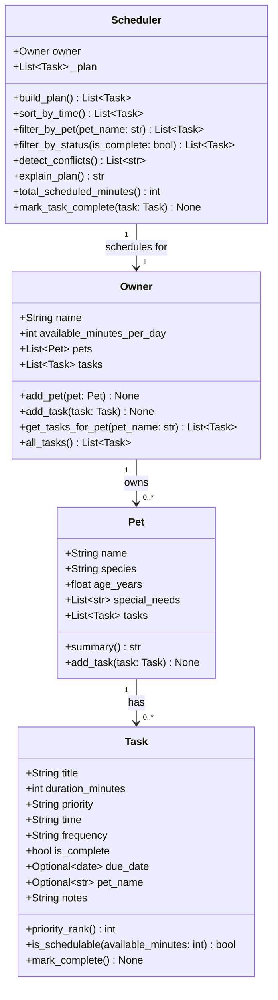

# PawPal+ — Class Diagram (Draft)

```mermaid
classDiagram
    class Task {
        +String title
        +int duration_minutes
        +String priority
        +String time
        +String frequency
        +bool is_complete
        +Optional~date~ due_date
        +Optional~str~ pet_name
        +String notes
        +priority_rank() int
        +is_schedulable(available_minutes: int) bool
        +mark_complete() None
    }

    class Pet {
        +String name
        +String species
        +float age_years
        +List~str~ special_needs
        +List~Task~ tasks
        +summary() str
        +add_task(task: Task) None
    }

    class Owner {
        +String name
        +int available_minutes_per_day
        +List~Pet~ pets
        +List~Task~ tasks
        +add_pet(pet: Pet) None
        +add_task(task: Task) None
        +get_tasks_for_pet(pet_name: str) List~Task~
        +all_tasks() List~Task~
    }

    class Scheduler {
        +Owner owner
        +List~Task~ _plan
        +build_plan() List~Task~
        +sort_by_time() List~Task~
        +filter_by_pet(pet_name: str) List~Task~
        +filter_by_status(is_complete: bool) List~Task~
        +detect_conflicts() List~str~
        +explain_plan() str
        +total_scheduled_minutes() int
        +mark_task_complete(task: Task) None
    }

    Owner "1" --> "0..*" Pet : owns
    Pet "1" --> "0..*" Task : has
    Scheduler "1" --> "1" Owner : schedules for
```
